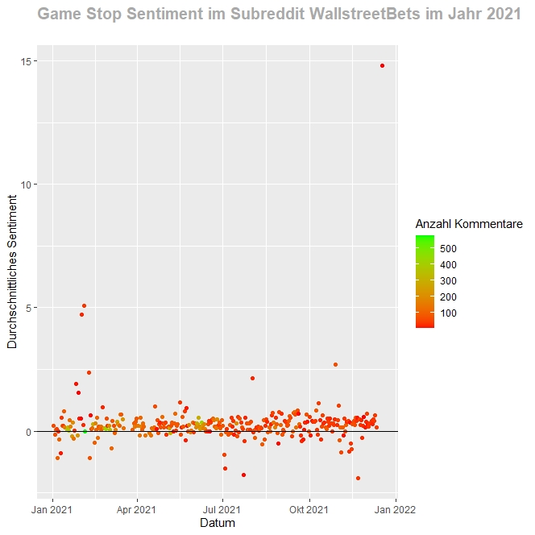

Predicting the stock price of GameStop using r/wallstreetbets
================

## Looking back to spring 2021

In the beginning of 2021 GameStop was an almost bankrupt company. Then
something strange happend on the subreddit r/wallstreetbets. This
subredit known for the “risk seeking” gamblers collectively decided to
pump up the GameStop price zo 420,69$. In addition to a potential big
gain for the gamblers and a funny meme the redditors also wanted to
challenge Wallstreet which had a large amount of short positions on
GameStop.

<!-- -->

## Including Plots

You can also embed plots, for example:

<!-- -->

Note that the `echo = FALSE` parameter was added to the code chunk to
prevent printing of the R code that generated the plot.
